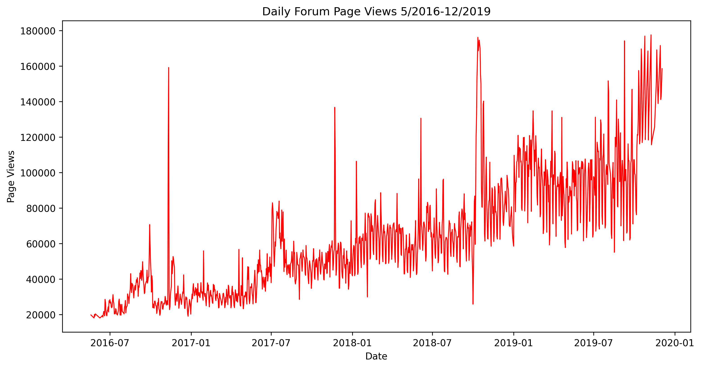
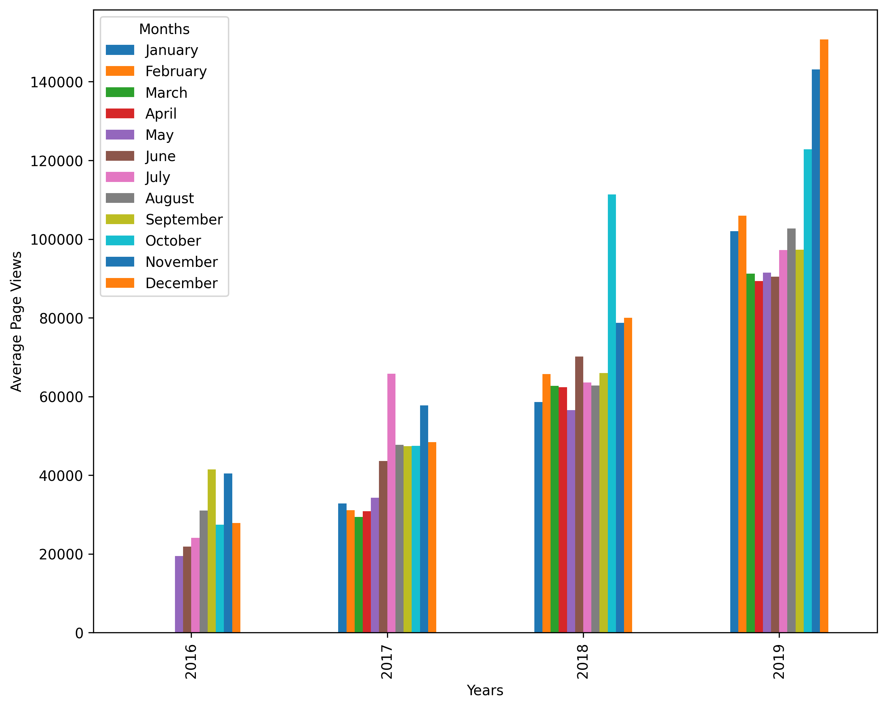
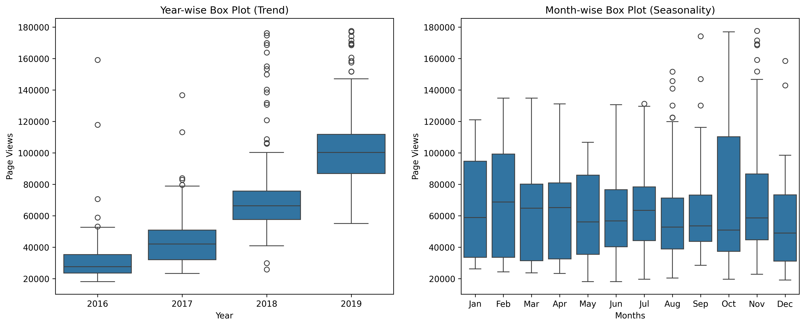

# Growth & Seasonality Analysis: ffc Global Forum Traffic

An end-to-end data pipeline analyzing 3.5+ years of daily traffic data to track community growth trends, identify annual traffic peaks, and isolate variance patterns using time-series analysis techniques.

## 📥 Executive Summary & Core Insights
* **Compound Growth:** Daily forum traffic grew over 400% between 2016 and late 2019, showing steady baseline adoption.
* **Q4 Traffic Surge:** Across all active years, October and November consistently exhibit the highest average daily page views, correlating heavily with seasonal coding bootcamps/initiatives.
* **Stabilizing Distribution:** Boxplot variance analysis shows that while traffic volume expanded massively, the relative distribution (spread) narrowed year-over-year, indicating a more stable, predictable user base.

## 🛠️ Data Pipeline Architecture
To ensure data integrity, the pipeline runs through three sequential phases:
1. **Anomaly Mitigation:** Stripped traffic anomalies (bot spikes or site outages) by filtering out data outside the central 95% distribution interval (2.5th to 97.5th percentiles).
2. **Feature Engineering:** Extracted temporal dimensions (Chronological Months, Years) out of index datetimes to support multi-dimensional grouping.
3. **Multi-Perspective Visualization:** Built custom reporting visuals focusing on Macro Growth (Line), Structural Seasonality (Grouped Bar), and Structural Variance (Boxplot).

## 📊 Visual Insights & Artifacts

### 1. Macro Growth Trajectory
The continuous line plot tracks baseline forum growth over a 3.5-year horizon, revealing a steady upward inflection curve in community acquisition.

<p align="center">
  
  <br>
  <em>Figure 1: Daily continuous traffic tracking (outliers removed).</em>
</p>

> **Analyst Takeaway:** The platform experienced a clear compounding growth phase starting in mid-2017, moving from a baseline of ~20,000 daily views to consistently exceeding 100,000 views by late 2019.

---

### 2. Seasonality Matrix
By grouping daily views into monthly averages across respective years, this visualization maps cyclical user behavior.

<p align="center">
  
  <br>
  <em>Figure 2: Year-over-year monthly seasonality distribution.</em>
</p>

> **Analyst Takeaway:** Q4 consistently represents peak engagement periods, with October and November outperforming preceding months. This suggests cyclical traffic drivers tied to seasonal learning patterns or year-end upskilling resolutions.

---

### 3. Variance & Spread Profiles
The dual box-plot layout shifts focus from rigid averages to distribution spreads, tracking data dispersion by year and month.

<p align="center">
  
  <br>
  <em>Figure 3: Yearly and monthly box-plot distributions mapping data variance.</em>
</p>

> **Analyst Takeaway:** Year-over-year plots show that the interquartile range (IQR) shifted upward symmetrically with the median, proving that growth is sustained across the board rather than inflated by occasional viral spikes.


## 🚀 Getting Started

Clone the repository and install dependencies:
```bash
git clone [https://github.com/Val-The-Analyst/fcc-forum-analytics.git](https://github.com/Val-The-Analyst/fcc-forum-analytics.git)
cd fcc-forum-analytics
pip install -r requirements.txt
```

Run the pipeline:
```bash
python src/visualizer.py
```
